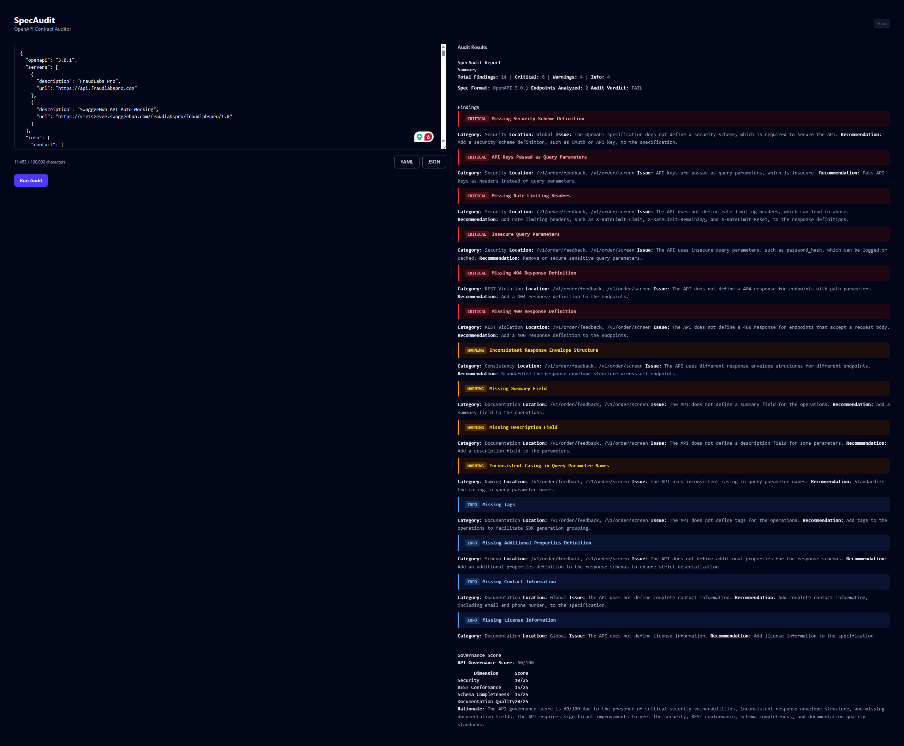

# SpecAudit

SpecAudit is an AI-powered OpenAPI contract auditor that analyzes your API specification for security vulnerabilities, REST convention violations, schema issues, and naming inconsistencies. It streams structured audit reports with severity-tagged findings directly in your browser.

## Tech Stack

| Backend | Frontend | AI Integration |
|---|---|---|
| .NET 10 Minimal APIs | React 19 + Vite + Tailwind CSS v4 | OpenAI-compatible providers (Groq, NVIDIA NIM, OpenRouter, Gemini, Together) |
| SSE (Server-Sent Events) streaming | react-markdown with severity styling | Provider-agnostic via OpenAI C# client |

## Prerequisites

- [.NET 10 SDK](https://dotnet.microsoft.com/download/dotnet/10.0)
- [Node.js 24+](https://nodejs.org/)
- An API key for one of the supported AI providers

## Setup

1. **Clone the repository:**
   ```bash
   git clone <repo-url>
   cd spec-audit
   ```

2. **Configure the backend:**
   ```bash
   cd backend
   dotnet user-secrets set "Ai:ApiKey" "your-key-here"
   ```

3. **Start the backend:**
   ```bash
   dotnet run
   ```
   The API is available at `http://localhost:5000`.

4. **Start the frontend** (in a separate terminal):
   ```bash
   cd frontend
   npm install
   npm run dev
   ```
   The UI is available at `http://localhost:5173`.

5. **Open `http://localhost:5173`** in your browser, paste an OpenAPI spec, and click **Run Audit**.

## Provider Configuration

SpecAudit supports any OpenAI-compatible provider. Change the provider by editing three values in `backend/appsettings.json`:

| Provider | `BaseUrl` | `ModelId` | Key prefix | Signup |
|---|---|---|---|---|
| **Groq** | `https://api.groq.com/openai/v1` | `llama-3.3-70b-versatile` | `gsk_` | [console.groq.com](https://console.groq.com) |
| **NVIDIA NIM** | `https://integrate.api.nvidia.com/v1` | `qwen/qwen2.5-coder-32b-instruct` | `nvapi-` | [build.nvidia.com](https://build.nvidia.com) |
| **OpenRouter** | `https://openrouter.ai/api/v1` | `meta-llama/llama-3.3-70b-instruct:free` | `sk-or-` | [openrouter.ai](https://openrouter.ai) |
| **Google Gemini** | `https://generativelanguage.googleapis.com/v1beta/openai/` | `gemini-2.0-flash` | `AIza` | [ai.google.dev](https://ai.google.dev) |
| **Together AI** | `https://api.together.xyz/v1` | `meta-llama/Llama-3-70b-chat-hf` | `tog-` | [api.together.ai](https://api.together.ai) |

> **Note:** `ProviderName` in `appsettings.json` is for display only and does not affect runtime behavior.

After changing the provider, run `dotnet user-secrets set "Ai:ApiKey" "your-key-here"` with the corresponding key.

## Running Tests

```bash
# Backend tests (requires .NET 10 SDK)
cd backend.Tests
dotnet test

# Frontend tests
cd frontend
npm test
```

## Screenshot


